# 🚗 DriveFlow — Car Rental Management System

A full-stack car rental management system built with HTML, CSS, JavaScript, Node.js, and MySQL. DriveFlow supports three distinct user roles — Customer, Employee, and Admin — each with a dedicated interface and set of features.

---

## 🔗 Live Demo

| Interface | Link |
|---|---|
| Login page | [driveflow-seven.vercel.app/login.html](https://driveflow-seven.vercel.app/login.html) |
| Customer Portal | [driveflow-seven.vercel.app/customer.html](https://driveflow-seven.vercel.app/customer.html) |
| Employee Dashboard | [driveflow-seven.vercel.app/employee.html](https://driveflow-seven.vercel.app/employee.html) |
| Admin Panel | [driveflow-seven.vercel.app/admin.html](https://driveflow-seven.vercel.app/admin.html) |

> The live demo is a static frontend showcase. The backend source code is available in this repository.

---

## 📋 Features

### Customer
- Register and log in
- Browse available fleet (filter by category, color, price)
- Book a vehicle with pickup/dropoff location and dates
- View booking history and status
- Upload identity documents (Driving License, CNIC, Passport)
- View invoices

### Employee
- View and manage all bookings (confirm, cancel)
- Conduct Check-Out and Check-In inspections (mileage, fuel, damage)
- Verify or reject customer documents
- Mark invoices as paid
- View assigned bookings

### Admin
- Full fleet management (add, edit, soft-delete vehicles)
- Employee management (add, suspend, terminate)
- View all bookings, invoices, and documents
- Maintenance log management
- Branch/location management

---

## 📸 Screenshots

<table>
  <tr>
    <td>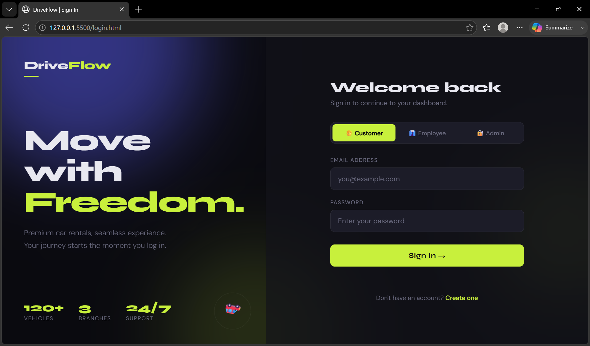</td>
    <td>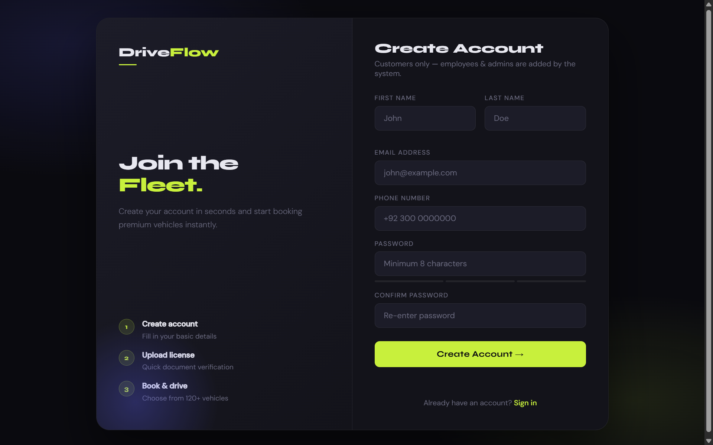</td>
  </tr>
  <tr>
    <td align="center">Home page / Login</td>
    <td align="center">Registeration</td>
  </tr>
</table>

### Customer
<table>
  <tr>
    <td>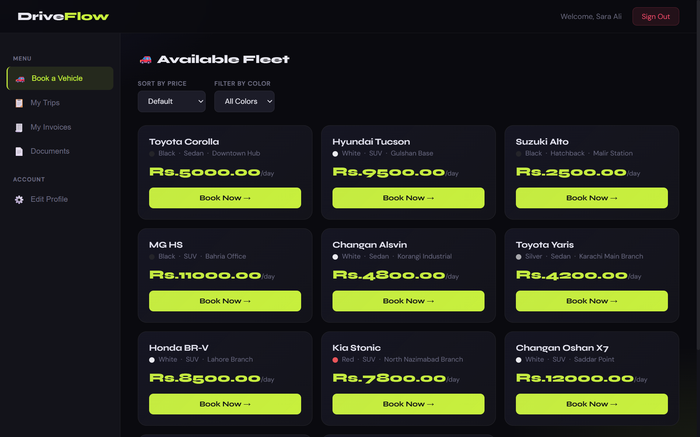</td>
    <td>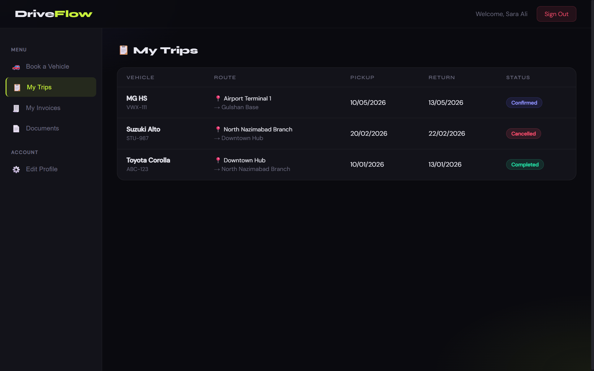</td>
    <td>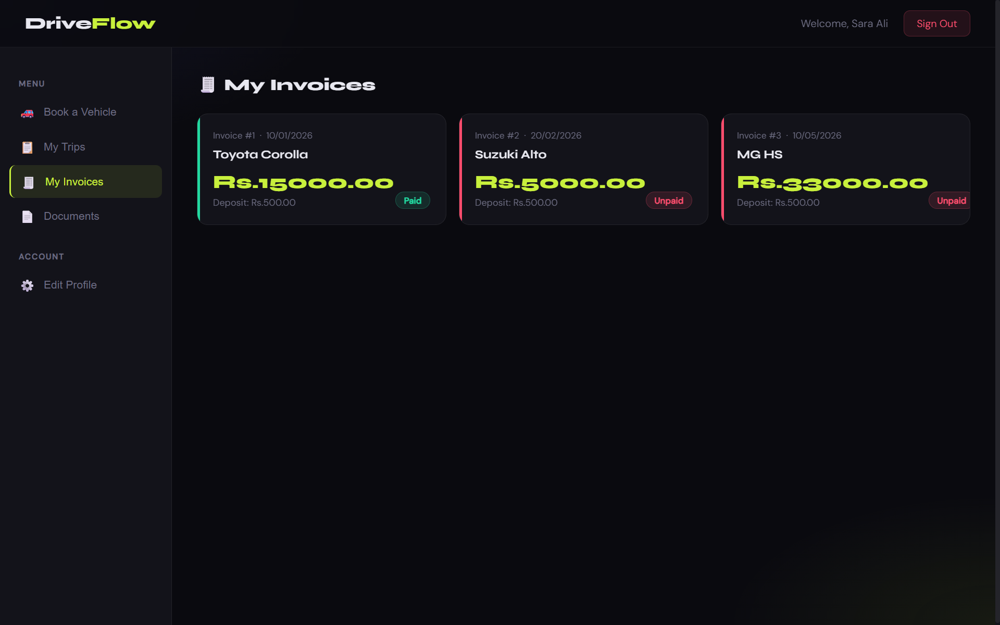</td>
  </tr>
  <tr>
    <td align="center">Customer Home</td>
    <td align="center">Booking</td>
    <td align="center">Invoices</td>
  </tr>
  <tr>
    <td>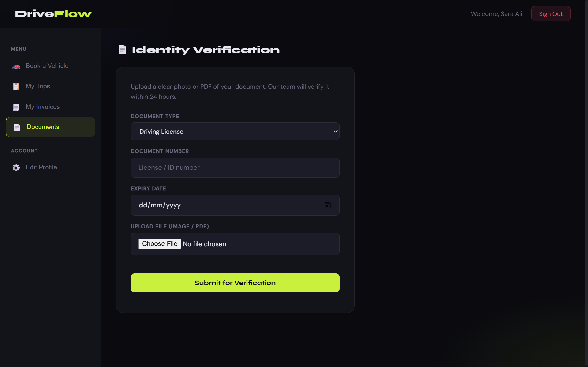</td>
    <td>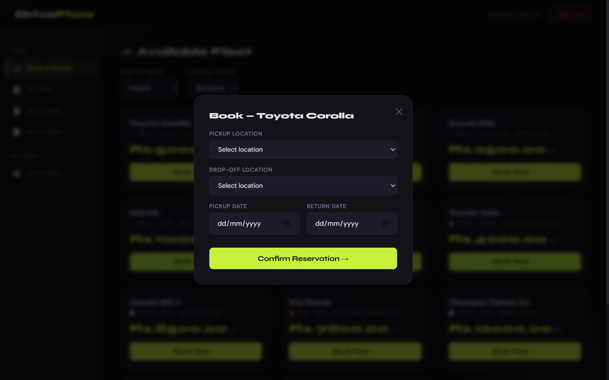</td>
    <td>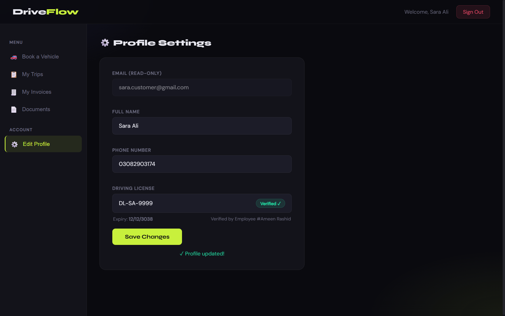</td>
  </tr>
  <tr>
    <td align="center">Document Verification</td>
    <td align="center">Vehicle Booking</td>
    <td align="center">Edit Profile</td>
  </tr>
</table>

### Employee
<table>
  <tr>
    <td>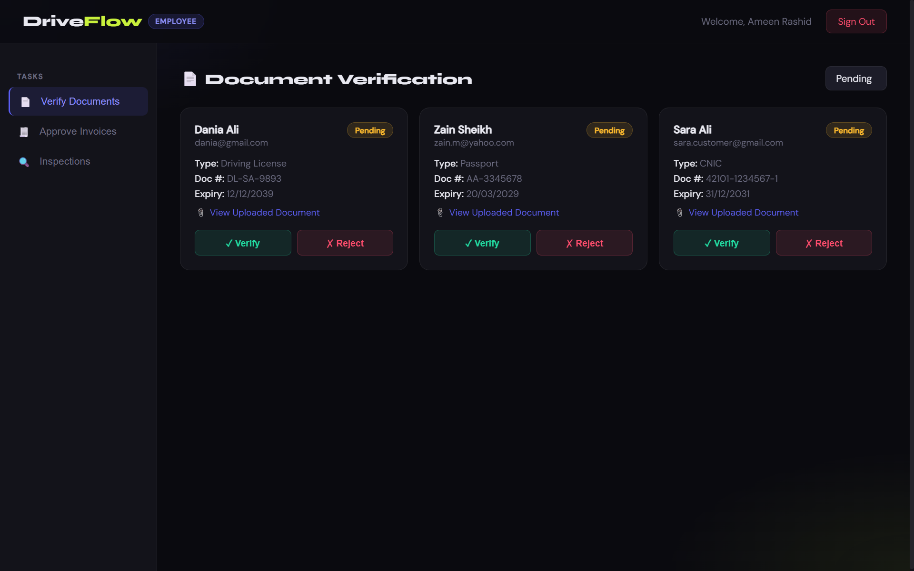</td>
    <td>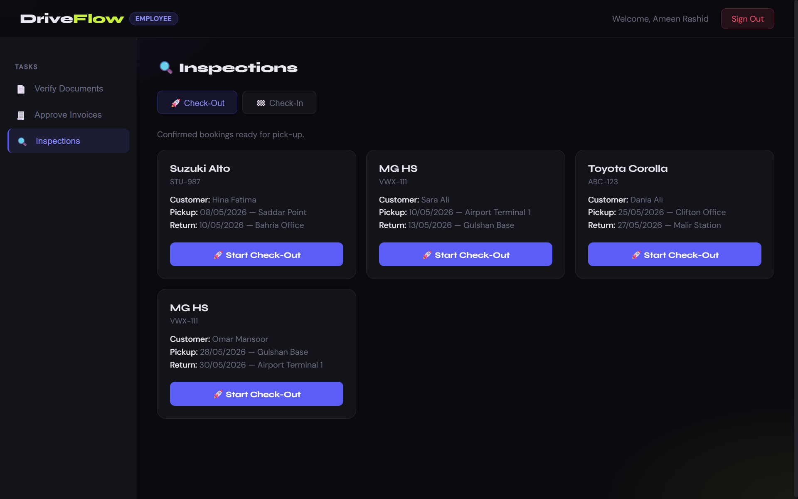</td>
    <td>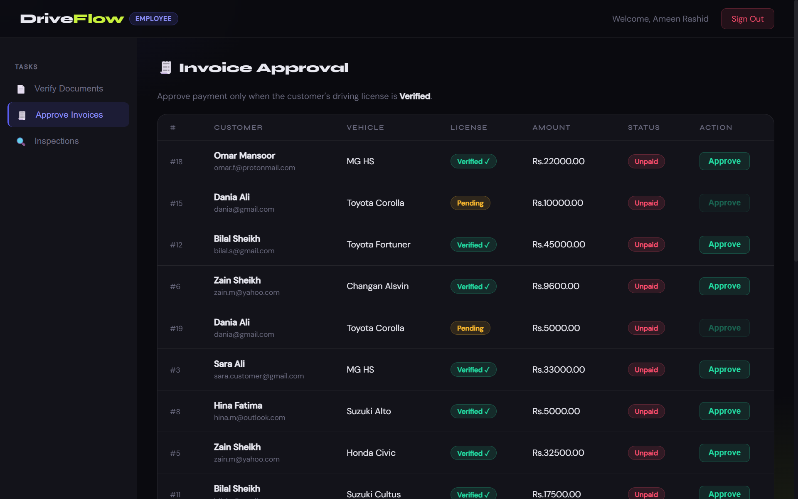</td>
  </tr>
  <tr>
    <td align="center">Document Verification</td>
    <td align="center">Vehicle Inspection</td>
    <td align="center">Invoice Management</td>
  </tr>
</table>

### Admin
<table>
  <tr>
    <td>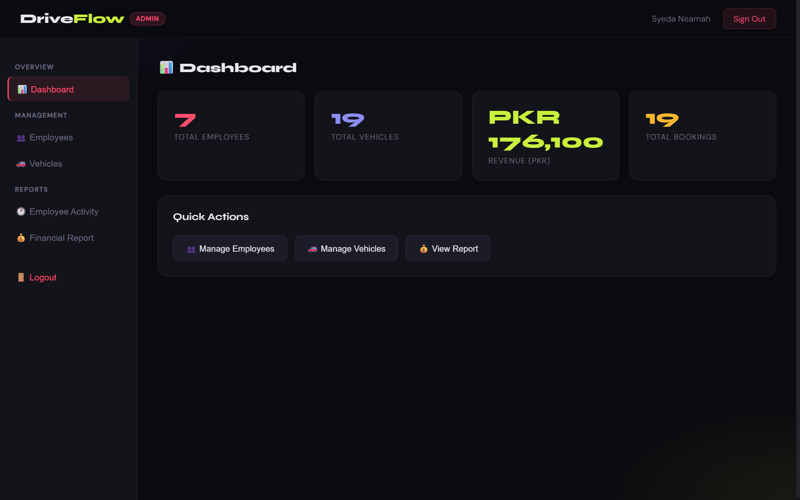</td>
    <td>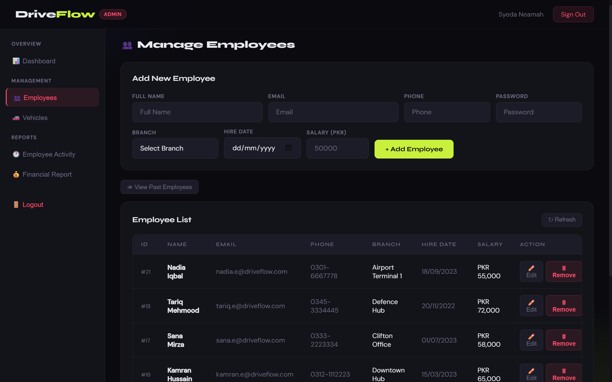</td>
    <td>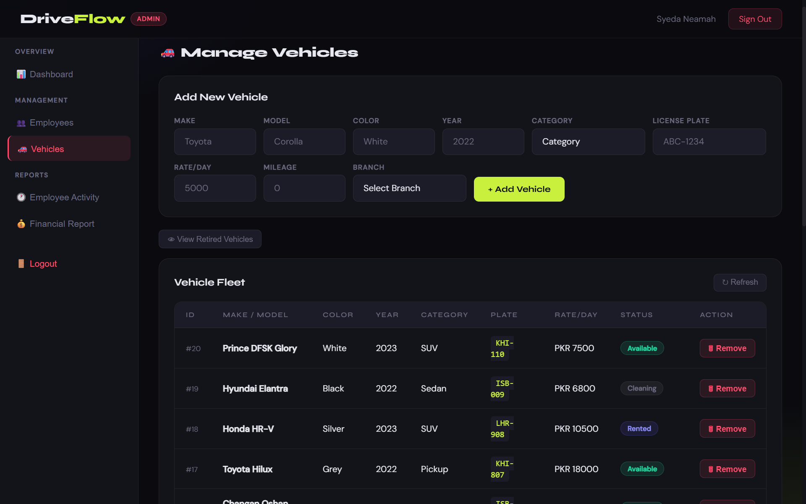</td>
  </tr>
  <tr>
    <td align="center">Admin Dashboard</td>
    <td align="center">Manage Employees</td>
    <td align="center">Manage Vehicles</td>
  </tr>
  <tr>
    <td>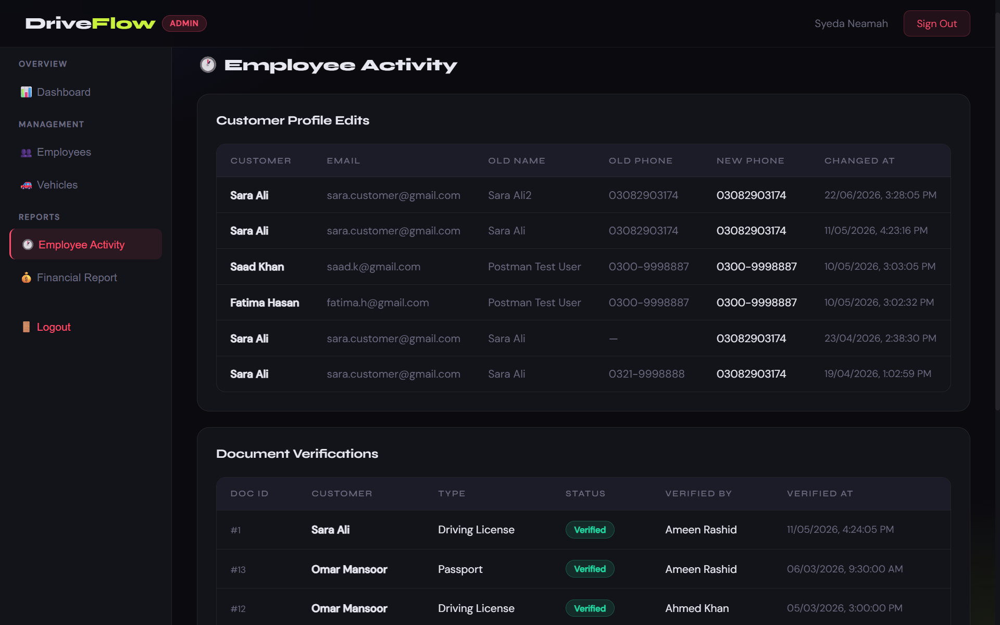</td>
    <td>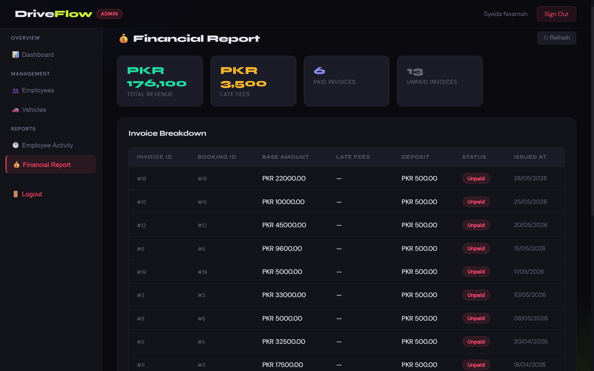</td>
  </tr>
  <tr>
    <td align="center">Employee Activity</td>
    <td align="center">Financial Report</td>
  </tr>
</table>

---

## 🛠️ Tech Stack

| Layer | Technology |
|---|---|
| Frontend | HTML, CSS, JavaScript |
| Backend | Node.js, Express.js |
| Database | MySQL |
| ORM/Driver | mysql2 |

---

## 🗄️ Database Design

The database consists of 9 tables with proper normalization, foreign key constraints, and soft delete support:

- `users` — authentication and role management
- `customers` / `employees` — role-specific profile data
- `vehicles` — fleet inventory with soft delete
- `locations` — branch locations
- `bookings` — rental reservations with rate snapshot
- `invoices` — auto-generated per booking
- `documents` — customer identity documents with verification
- `inspections` — check-out and check-in records
- `maintenancelogs` — vehicle service history

Key design decisions:
- **Soft delete** on users and vehicles — records are never hard deleted
- **ON DELETE SET NULL** on employee references — history preserved after staff removal
- **rate_at_booking** snapshot — price frozen at time of booking regardless of future rate changes
- **Trigger** — `before_profile_update` logs name/phone changes to `users_backup`
- **Views** — `AvailableFleet`, `CustomerBookingSummary`, `CustomerDetails`

---

## 📁 Project Structure

```
Driveflow/
├── dumps/                  # SQL dump file
└── implementation/
    ├── server.js           # Express backend (API routes)
    ├── admin.html          # Admin interface
    ├── employee.html       # Employee interface
    ├── customer.html       # Customer interface
    ├── .env                # Environment variables (not committed)
    ├── .gitignore
    ├── uploads/            # Uploaded document files
    └── node_modules/
```

---

## ⚙️ Running Locally

### Prerequisites
- Node.js
- MySQL

### Steps

1. Clone the repository
```bash
git clone https://github.com/neamah-k/Driveflow.git
cd Driveflow/implementation
```

2. Install dependencies
```bash
npm install
```

3. Create a `.env` file in the `implementation` folder
```
DB_HOST=localhost
DB_USER=root
DB_PASS=your_password
DB_NAME=car_rental
PORT=5000
```

4. Import the database
```bash
mysql -u root -p < ../dumps/sample.sql
```

5. Start the server
```bash
nodemon server.js
```

6. Open any of the HTML files in your browser or visit `http://localhost:5000`

---

## 🔐 Demo Credentials (Local)

| Role | Email | Password |
|---|---|---|
| Admin | neamah@driveflow.com | admin |
| Employee | ameen.e@driveflow.com | 123 |
| Customer | sara.customer@gmail.com | 123 |

---

## 📊 Diagrams

### Entity Relationship Diagram
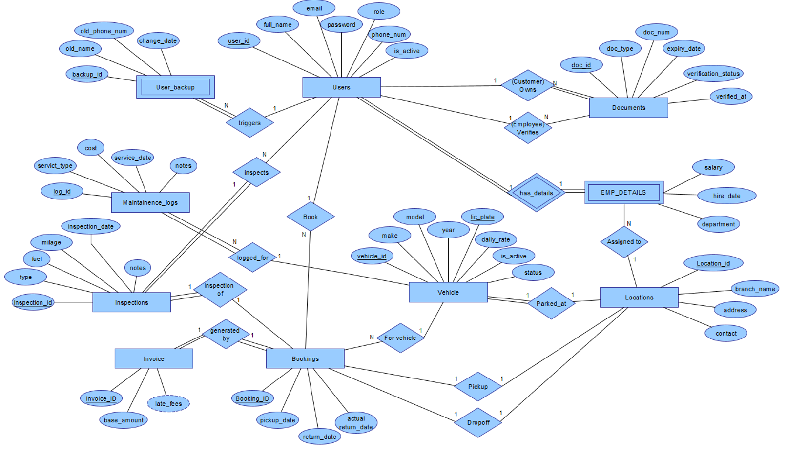

### Use Case Diagram
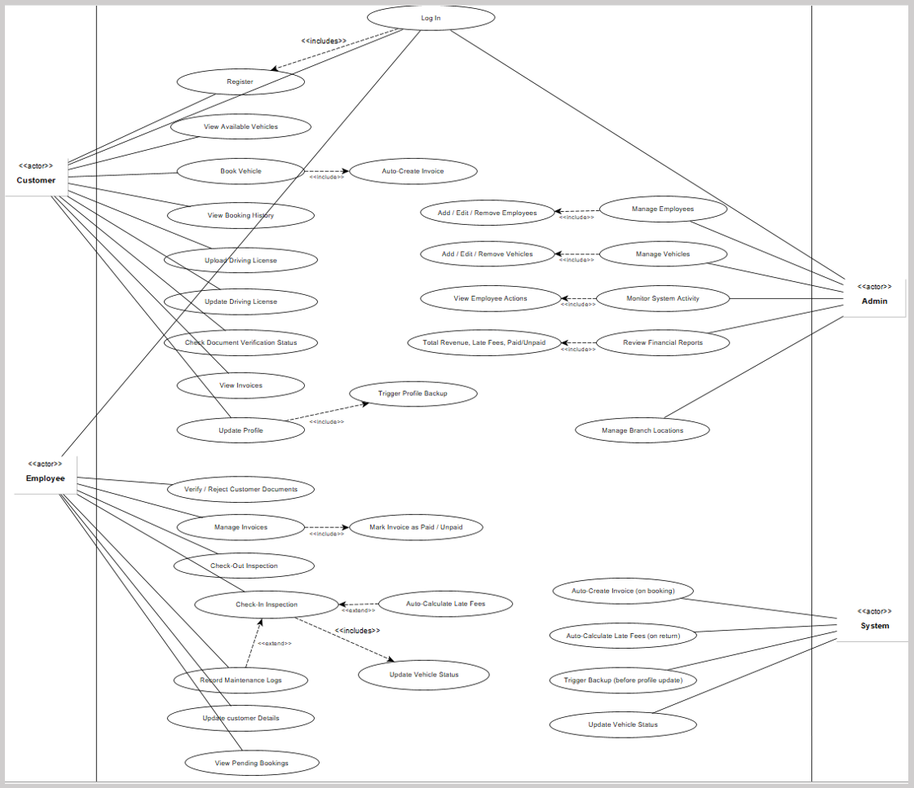

---

## 👥 Team

- Syeda Neamah
- Pareena Kumari
- Aila Naeem